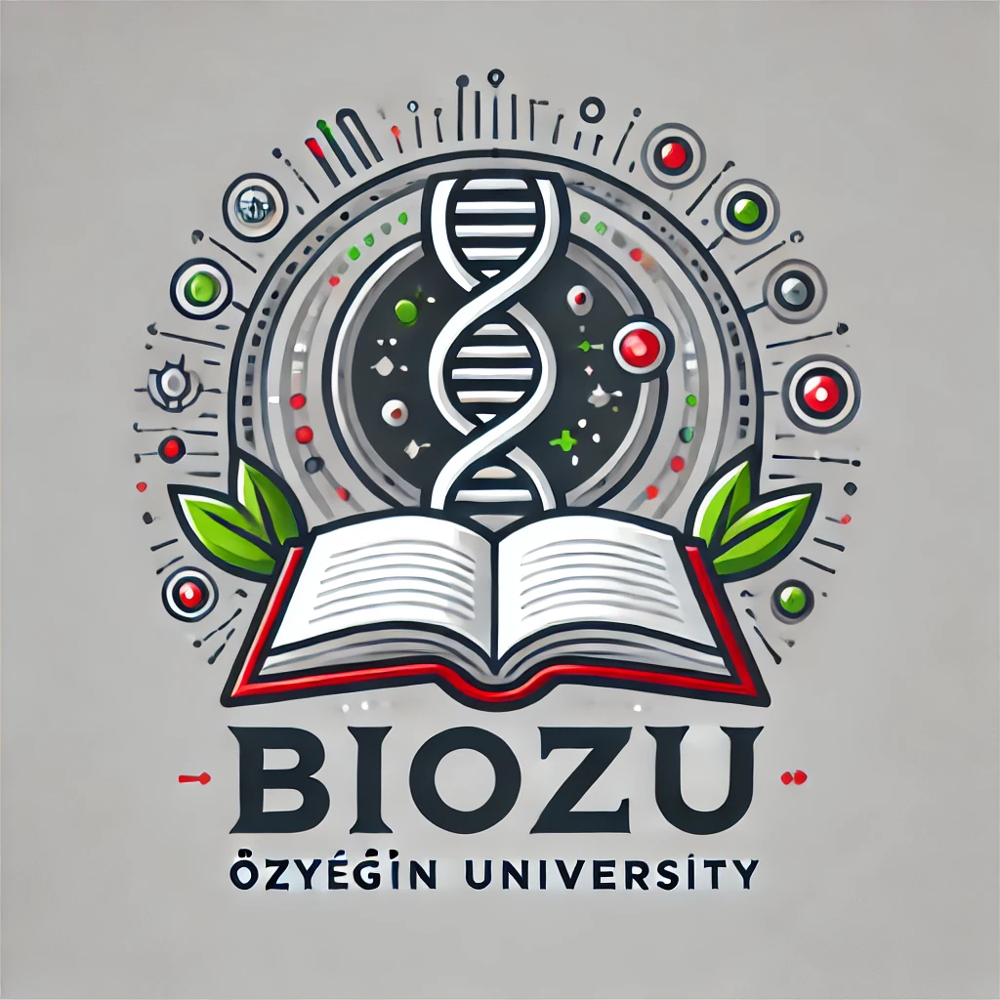

# BioLaySumm-BiOzU: Query Independent Gemini + Graph-based Extractive Summarization with RAG

 

## Overview

**BioLaySumm-BiOzU** is a cutting-edge project developed for the BioLaySumm competition. It generates high-quality lay summaries for scientific articles by leveraging advanced NLP techniques. The current approach integrates a powerful **Gemini model** for text generation with a **graph-based extractive summarization** method within a query independent Retrieval-Augmented Generation (RAG) framework.

---

## Features

### Main Components

1. **Advanced Generation with Gemini Model**
   - Utilizes the superior text understanding and generation capabilities of the Gemini model.
   - Provides improved performance, fluency, and adaptability in summarizing complex scientific texts.

2. **Query Independent RAG Architecture**
   - Directly leverages the article’s structural and semantic information without relying on external queries.
   - Enhances the consistency and comprehensiveness of the generated lay summaries.
   
   **Methodology:**
   - **BioBERT for Sentence Embeddings**
     - Generates robust embeddings for each sentence.
     
   - **SimilarityRAG**
     - Incorporates similarity with title embedding models to ensure that selected sentences align closely with the article’s core message.
     
   - **PageRankRAG**
     - Constructs a graph representation of the article.
     - Employs the PageRank algorithm to rank sentences based on their connectivity and importance within the graph.
     
   - **Graph-based Extractive Summarization RAG (GES-RAG)**
     - Constructs a graph representation of the article.
     - Utilizes Graph Embedding Summarization (GES) to identify and rank the most influential sentences.

3. **Dynamic Input Creation**
   - Merges the article’s graph-selected key sentences from **Title** and **All Sections** to form a dynamic prompt.
   - Ensures the Gemini model processes critical content effectively for high-quality summary generation.


---

## Workflow

1. **Data Preprocessing**
   - Scientific articles are parsed to extract key sections such as the title, abstract, keywords, and more.

2. **Sentence Embedding Extraction**
   - Generates representative embeddings for each sentence using advanced embedding techniques.

3. **Graph Construction and Ranking**
   - Constructs a graph where nodes represent sentences and edges represent semantic similarities.
   - Applies the **PageRank algorithm** to identify and rank the most influential sentences.

4. **Similarity with Title Embedding**
   - Computes similarity scores between each sentence and the title using title embedding models.
   - Refines the selection of key sentences to ensure relevance to the article’s main theme.

5. **Dynamic Input Creation**
   - Combines the title, abstract, and selected sentences into a dynamic prompt tailored for the Gemini model.

6. **Summary Generation**
   - The Gemini model processes the dynamic prompt to generate a coherent, lay-friendly summary.

---

## Installation

Clone the repository and install the required dependencies:

```bash
git clone https://github.com/your-username/BioLaySumm-BiOzU.git
cd BioLaySumm-BiOzU
poetry install
